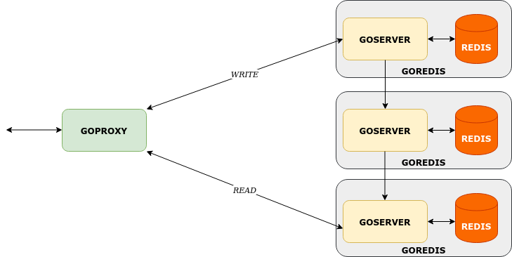

# Kube Chain Replication

A chain replicated KV store using Kubernetes, Golang &amp; Redis

## Introduction

Chain replication is used to provide consistency and is an alternative method compared to primary-backup replication. It works by immediately sending write requests to neighbor nodes in a chain like fashion. All write requests are sent to the first node called "Head" which is then transmitted to all other nodes and read requests are sent to the last node called "Tail" managed via a proxy.



## Steps

After cloning the repo. To start up the cluster:

    $ minikube start
    $ make all
    $ kubectl apply -f goredis.yaml
    $ kubectl create clusterrolebinding list-view --clusterrole=view --serviceaccount=craq:default
    $ kubectl apply -f goproxy.yaml
    
This creates the namespace the proxy pod and 3 (default) pods for the chain nodes.

To send requests, we first need to obtain the IP of the GoProxy (service coming soon!) and initialize the chain:

```
$ kubectl get pods -n craq
$ (copy the IP of goproxy)
$ curl -i <GoProxyIP>:8090/chain/neighbors
```

Now we can send requests to Get and Set Key Values 

```
$ curl -i -X POST <GoProxyIP>:8090/store/set -d '{"key":"<key>","value":"<value>"}'
$ curl -i <GoProxyIP>:8090/store/get/<key>
```

In the logs for each goredis pod, in goserver it will show that the KV pair gets set in the HEAD node first and then transmits the same write request to every node in the chain to be set. The logs of the TAIL will show that the reads are now acessed from the TAIL. 

To teardown the cluster and remove the built docker images:

```
$ minikube stop 
$ make stop 
```

This is not certain to clean up all the locally created docker images at times. You can do a docker rmi to delete them.

##  Kubernetes Cluster

The cluster here is tested on minkube locally on an Ubuntu machine. Future work will look at deploying the cluster using kubeadm, k3s and GKE.

An advantage of using kubernetes over docker-compose here is adding multiple containers to be encapsulated in a single entity (in kubernetes speak, a pod),  and creating multiplpe clusters across nodes.

You can scale the chain to add more nodes by modifying replicas in goredis.yaml and reapplying using kubectl.

## GoProxy 

GoProxy is a wrapper for the chain to make it look like a client is interacting with a single instance. It uses kubernetes client-go heavily to get the IPs of the goredis pods and communicate with them.

##  GoRedis 

GoRedis  pod contains a go server and a redis instance to act as a KV store. It also has the functionality to transmit the write to the next node in the chain.

## Future Improvements

 - Kubernetes service to expose proxy. 
 - Redis snapshot to handle faillovers. 
 - Multinode cluster transmission for replication across different locations.

## References

 - [Object Storage on CRAQ Paper](https://www.cs.princeton.edu/courses/archive/fall19/cos418/papers/craq.pdf) [Jeff Terrace and Michael J. Freedman]
 - [PWL Chain Replication Talk](https://www.youtube.com/watch?v=1hDjkV4iFzs) [Deniz Altınbüken]
 - [Go client for Kubernetes.](https://github.com/kubernetes/client-go)

